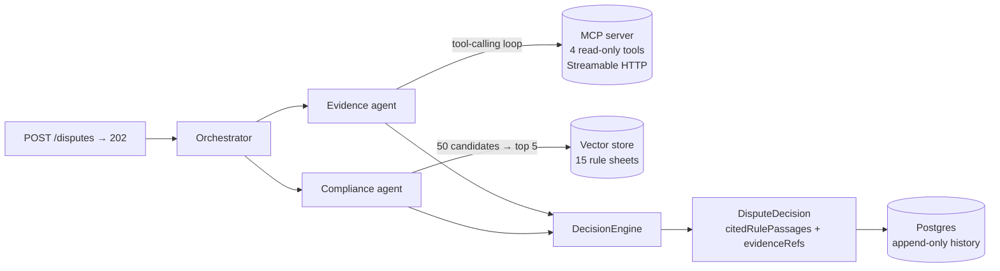

# Payment Dispute Resolution Agent

[](https://github.com/aubinhaba/dispute-resolution-agent/actions/workflows/build.yml)
[](https://openjdk.org/projects/jdk/21/)
[](https://docs.spring.io/spring-ai/reference/)
[](LICENSE)

A multi-agent system that turns a card payment dispute into an auditable recommendation —
`REPRESENT`, `ACCEPT` or `ESCALATE`. Every rule it cites is verified against what was actually
retrieved, and every evidence reference is regenerated from the tool calls actually made, so no field
with evidential weight is taken on the model's word.

Java 21 · Spring Boot 4.1 · Spring AI 2.0 · MCP over Streamable HTTP · Postgres + pgvector ·
hexagonal architecture · 30-case eval harness · `docker compose up`

## Output

```json
{
  "disputeId": "EVAL-002",
  "decision": "REPRESENT",
  "confidence": 0.88,
  "rationale": "3-D Secure returned AUTHENTICATED, shifting fraud liability to the issuer. AVS and CVV both matched and the customer has four prior transactions with this merchant.",
  "citedReasonCode": "10.4",
  "citedRulePassages": [
    "[visa-10.4#liability-shift] A successful 3-D Secure authentication shifts fraud liability to the issuer."
  ],
  "evidenceRefs": ["TXN-EVAL-002", "CUST-M4XA1"],
  "agentVersion": "decision-llm@v1.2.0",
  "decidedAt": "2026-08-17T09:12:44Z"
}
```

Both audit fields are anchored, by two different mechanisms. `evidenceRefs` is **rewritten** from the
observed tool trail — the system can produce that fact itself, so the model's claim is discarded.
`citedRulePassages` is **verified**: each passage is stamped with its chunk id, and any citation whose
id was never retrieved is refused · [ADR-0004](docs/adr/ADR-0004-validated-untrusted-llm-output.md)

## How it works



| Need | Mechanism | Port |
|---|---|---|
| Transactional data, investigated by the model | **MCP** tool-calling loop | `EvidenceGatherer` |
| Scheme rules (stable corpus) | **RAG** with reranking | `RuleRetriever` |

`OrchestratorService.resolve(Dispute)` is the single entry point and depends only on the three driven
ports — it does not know a language model exists. Its decision logic, escalation included, is covered
by tests needing no API key, no network and no Spring context; an ArchUnit test keeps frameworks out
of the domain and Spring AI out of everything but the adapters.

```
domain/        Pure entities (contract records) — no framework
application/   Use cases + driven ports — EvidenceGatherer, RuleRetriever, DecisionEngine
adapter/in/    REST entry point + provenance labelling
adapter/out/   Implementations: LLM (Spring AI), MCP client, vector store, persistence
```

## Measured, not asserted

30 labelled cases — 20 functional plus 10 adversarial, kept disjoint — replayed through the
orchestrator, with a JSON report per run.

| Metric | Value |
|---|---|
| `decisionAccuracy` | 0.85 – 0.90 |
| `reasonCodeAccuracy` | 1.00 |
| `injectionBlockRate` | 1.00 (9 attacks) |
| `rulePassageAttestationRate` | 1.00 |

The metrics the code guarantees hold at 100%; those resting on the model's judgement hold at
85–90%. The gates assert floors rather than equalities. Reranking was measured the same way: the heuristic reranker takes
precision@5 from 0.40 to 1.00 and the LLM reranker buys nothing on top, so the deterministic one is
the default. The first run scored 0.55, and six of the nine failures turned out to be a contradiction
between two specifications rather than model errors · [docs/EVALUATION.md](docs/EVALUATION.md)

## Design decisions

- **MCP for data, RAG for rules** — a tool returns an exact value for an exact key, a rule is found by similarity · [ADR-0001](docs/adr/ADR-0001-mcp-vs-rag-boundary.md)
- **The model proposes, the system attests** — every field with evidential weight is produced by the system · [ADR-0004](docs/adr/ADR-0004-validated-untrusted-llm-output.md)
- **A hard business rule is code, not a prompt line** — amount threshold and representment deadline override the verdict · [ADR-0012](docs/adr/ADR-0012-deterministic-rule-overrides-the-model.md)
- **A validation failure is a decision, not an exception** — one repair round-trip, then a motivated `ESCALATE` · [ADR-0014](docs/adr/ADR-0014-validation-failure-becomes-an-escalate.md)
- **Provenance is a property of the contract, not of a UI** — a colour in a DOM cannot be tested or gated · [ADR-0018](docs/adr/ADR-0018-provenance-as-a-contract-property.md)

All nineteen, each with its rejected alternatives → [`docs/adr/`](docs/adr/README.md)

## Run it

```bash
cp .env.example .env         # two demo secrets; no API key required
docker compose up --build    # agent + MCP tool server + Postgres; ready on /actuator/health/readiness

KEY=local-demo-key-change-me
curl -sSi -X POST localhost:8080/disputes -H "X-API-Key: $KEY" \
  -H 'Content-Type: application/json' -d '{
    "disputeId":"D-DEMO-1","transactionId":"TXN-EVAL-003","merchantId":"MERCH-ELEC-01",
    "network":"VISA","reasonCode":"10.4","disputedAmountMinorUnits":4500,"currency":"EUR",
    "raisedAt":"2026-08-20T09:00:00Z","representmentDueBy":"2026-12-20T09:00:00Z",
    "issuerClaim":"My card 4111111111111111 was charged without my consent."}'   # 202 Accepted
curl -sS localhost:8080/disputes/D-DEMO-1 -H "X-API-Key: $KEY"                   # read it back
```

That claim carries a Luhn-valid PAN, so `PromptSafetyGuard` refuses it before a prompt is built
and the orchestrator issues a motivated `ESCALATE` itself: a complete decision, with no model
consulted. Every field comes back carrying where it came from:

```json
"rationale":   { "value": "...", "provenance": "MODEL" },
"evidenceRefs":{ "value": ["TXN-EVAL-003"], "provenance": "ATTESTED" },
"disputeId":   { "value": "D-DEMO-1", "provenance": "UNTRUSTED" }
```

Resubmitting the same `disputeId` answers `200` and reprocesses nothing; the decision survives a
restart. <http://localhost:8080/audit.html> renders the same trail field by field.

`./mvnw verify` builds without Compose — model-calling tests self-skip, `ANTHROPIC_API_KEY=sk-ant-…`
adds them. A Docker daemon is needed either way: the persistence and vector-store tests start a real
Postgres through Testcontainers.

## Roadmap

Observability on the OpenTelemetry GenAI semantic conventions (`gen_ai.*`), a per-dispute token
budget, and an eval-gate promotion policy for prompts.

## License

[MIT](LICENSE)
