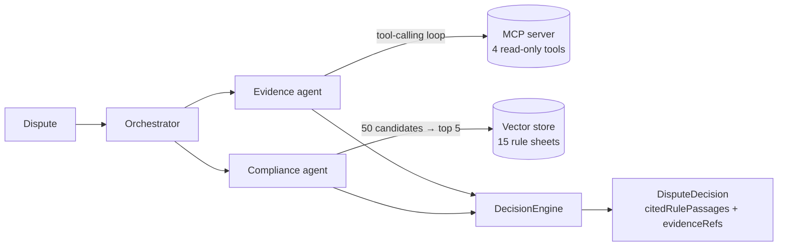

# Multi-Agent Payment Dispute Resolution System

A multi-agent system that analyses payment disputes and returns an auditable recommendation — `REPRESENT`, `ACCEPT` or
`ESCALATE` — together with the rules it cited and the evidence it actually fetched.

## Status

Work in progress, built in steps. Current base:

- hexagonal skeleton, locked data contract, structured output with a validation guardrail
- `mcp-payment-server` — four read-only transactional tools over mocked data, spoken over STDIO
- **evidence agent** — a tool-calling loop over those tools, with an attested evidence trail
- **compliance agent** — RAG with reranking over a 15-sheet card-scheme rule corpus
- **orchestrator** — dispatch, composition, and a deterministic escalation rule that overrides the
  model

Next: output guardrails and the eval harness.

## Architecture



`OrchestratorService.resolve(Dispute)` is the single entry point, and it depends only on the three
driven ports — it does not know a language model exists. Its whole decision logic, escalation
included, is covered by tests that need no API key, no network and no Spring context. Clean
Architecture is enforced by an ArchUnit test that keeps frameworks out of the domain, and Spring AI
out of everything but the adapters.

```
domain/        Pure entities (contract records) — no framework
application/   Use cases + driven ports — EvidenceGatherer, RuleRetriever, DecisionEngine
adapter/out/   Implementations: LLM (Spring AI), MCP client, vector store
```

| Need | Mechanism | Port |
|---|---|---|
| Transactional data, investigated by the model | **MCP** tool-calling loop | `EvidenceGatherer` |
| Transactional data, fetched on a known path | **MCP** tools | `TransactionGateway` |
| Business rules (stable corpus) | **RAG** | `RuleRetriever` |

### What reranking is worth

The rule corpus is built so retrieval has something to get wrong: five catalogue reason codes, six
deliberately confusable sheets (Visa 10.4 and Mastercard 4837 both describe fraud), four
cross-cutting ones. Over eight labelled disputes, same corpus and queries:

| Configuration | precision@5 | Cost |
|---|---|---|
| No reranking (control) | 0.40 | none |
| Heuristic reranking | **1.00** | none |
| LLM reranking | **1.00** | one model call per dispute |

The LLM reranker buys no measurable gain here, hence the deterministic default. The 1.00 carries its
caveat, stated in `RerankComparisonIT` itself: relevance judgements are written per sheet while the
reranker ranks by sheet membership, so metric and system share a signal — a good regression signal,
weak evidence of absolute quality.

## Design decisions

Each one is recorded, with its rejected alternatives, under [`docs/adr/`](docs/adr).

- **MCP for data, RAG for rules** — a tool returns an exact value for an exact key, a rule is found
  by similarity · [ADR-0001](docs/adr/ADR-0001-mcp-vs-rag-boundary.md)
- **The model proposes, the system attests** — every field with evidential weight is produced by the
  system, not the model · [ADR-0004](docs/adr/ADR-0004-validated-untrusted-llm-output.md)
- **A hard business rule is code, not a prompt line** — the escalation threshold overrides the model
  verdict without discarding its analysis ·
  [ADR-0012](docs/adr/ADR-0012-deterministic-rule-overrides-the-model.md)
- **Agents are out adapters** — "agent" names a technique, the port names a responsibility ·
  [ADR-0009](docs/adr/ADR-0009-llm-agents-as-out-adapters.md)
- **The tool-calling loop is delegated, not hand-written** — the framework owns the turns, this code
  owns the budget and the trail · [ADR-0002](docs/adr/ADR-0002-framework-tool-calling-loop.md)
- **Modular RAG blocks, not the advisor** — an advisor melts passages into the prompt and dissolves
  the citation · [ADR-0010](docs/adr/ADR-0010-modular-rag-blocks-over-advisor.md)
- **Local, deterministic embeddings** — reproducibility, not cost ·
  [ADR-0011](docs/adr/ADR-0011-local-onnx-embeddings.md)
- **Boot 4 + Spring AI 2.0**, ports in the application layer, standalone MCP server ·
  [ADR-0006](docs/adr/ADR-0006-spring-boot-4-spring-ai-2.md) ·
  [ADR-0007](docs/adr/ADR-0007-ports-in-application-layer.md) ·
  [ADR-0008](docs/adr/ADR-0008-standalone-mcp-server.md)

Tiered ranking, structure-aware chunking and attested citations are documented where they are
implemented, in `adapter/out/vectorstore` and `adapter/out/agent`. Two integration tests drive the
raw protocols by hand — `RawToolLoopDemoIT` for the tool-calling loop, `RagAdvisorDemoIT` for the
advisor path — as executable references of what the framework does, and of what this project chose
not to use.

## Tech stack

Java 21 · Spring Boot 4.1 · **Spring AI 2.0** (ChatClient, structured output, modular RAG, MCP) ·
MCP Java SDK 2.0 · JUnit 5, AssertJ, ArchUnit

## Build and test

Requirements: JDK 21 and Maven. An Anthropic API key is optional.

```bash
mvn verify                            # model-calling tests are skipped without a key

export ANTHROPIC_API_KEY=sk-ant-...   # read from the environment, never committed
mvn verify                            # adds the tests that make real model calls
```

Retrieval measurements are never gated: embeddings run locally, so RAG quality is verifiable
offline. `mcp-payment-server` needs no key either — it exposes tools, it never calls a model — and
packages as a standalone STDIO server that the agent launches as a subprocess.

## License

[MIT](LICENSE).
