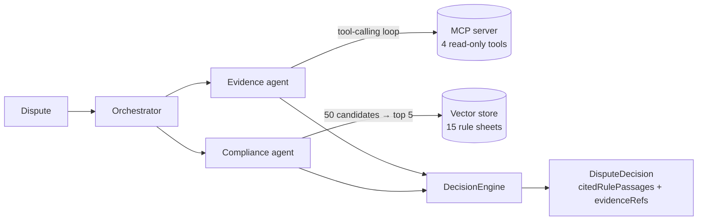

# Payment Dispute Resolution Agent

[](https://github.com/aubinhaba/dispute-resolution-agent/actions/workflows/ci.yml)
[](https://openjdk.org/projects/jdk/21/)
[](https://docs.spring.io/spring-ai/reference/)
[](LICENSE)

A multi-agent system that turns a card payment dispute into an auditable recommendation —
`REPRESENT`, `ACCEPT` or `ESCALATE`. Every rule it cites is verified against what was actually
retrieved, and every evidence reference is regenerated from the tool calls actually made, so no field
with evidential weight is taken on the model's word.

Java 21 · Spring Boot 4.1 · Spring AI 2.0 · MCP · hexagonal architecture · 30-case eval harness

## Output

```json
{
  "disputeId": "EVAL-002",
  "decision": "REPRESENT",
  "confidence": 0.88,
  "rationale": "3-D Secure returned AUTHENTICATED, shifting fraud liability to the issuer. AVS and CVV both matched and the customer has four prior transactions with this merchant.",
  "citedReasonCode": "10.4",
  "citedRulePassages": [
    "[visa-10.4#liability-shift] A successful 3-D Secure authentication shifts fraud liability to the issuer."
  ],
  "evidenceRefs": ["TXN-EVAL-002", "CUST-M4XA1"],
  "agentVersion": "decision-llm@v1.2.0",
  "decidedAt": "2026-08-17T09:12:44Z"
}
```

Both audit fields are anchored, by two different mechanisms. `evidenceRefs` is **rewritten** from the
observed tool trail — the system can produce that fact itself, so the model's claim is discarded.
`citedRulePassages` is **verified**: each passage is stamped with its chunk id, and any citation whose
id was never retrieved is refused · [ADR-0004](docs/adr/ADR-0004-validated-untrusted-llm-output.md)

## How it works



| Need | Mechanism | Port |
|---|---|---|
| Transactional data, investigated by the model | **MCP** tool-calling loop | `EvidenceGatherer` |
| Scheme rules (stable corpus) | **RAG** with reranking | `RuleRetriever` |

`OrchestratorService.resolve(Dispute)` is the single entry point and depends only on the three driven
ports — it does not know a language model exists. Its decision logic, escalation included, is covered
by tests needing no API key, no network and no Spring context; an ArchUnit test keeps frameworks out
of the domain and Spring AI out of everything but the adapters.

```
domain/        Pure entities (contract records) — no framework
application/   Use cases + driven ports — EvidenceGatherer, RuleRetriever, DecisionEngine
adapter/out/   Implementations: LLM (Spring AI), MCP client, vector store
```

## Measured, not asserted

30 labelled cases — 20 functional plus 10 adversarial, kept disjoint — replayed through the
orchestrator, with a JSON report per run.

| Metric | Value |
|---|---|
| `decisionAccuracy` | 0.85 – 0.90 |
| `reasonCodeAccuracy` | 1.00 |
| `injectionBlockRate` | 1.00 (9 attacks) |
| `rulePassageAttestationRate` | 1.00 |

What code guarantees holds at 100%; what rests on the model's judgement holds at 85–90%. Gates
assert floors, never equalities.

| Reranking, over 8 disputes | precision@5 | Cost |
|---|---|---|
| None (control) | 0.40 | none |
| Heuristic | **1.00** | none |
| LLM | **1.00** | one model call per dispute |

The LLM reranker buys nothing measurable here, so the deterministic one is the default.

**The first eval run scored 0.55 — and six of the nine failures were a contradiction between two
specifications, not model errors.** → [docs/EVALUATION.md](docs/EVALUATION.md)

## Engineering decisions

Each recorded with its rejected alternatives under [`docs/adr/`](docs/adr):

- **MCP for data, RAG for rules** — a tool returns an exact value for an exact key, a rule is found by similarity · [ADR-0001](docs/adr/ADR-0001-mcp-vs-rag-boundary.md)
- **The model proposes, the system attests** — every field with evidential weight is produced by the system · [ADR-0004](docs/adr/ADR-0004-validated-untrusted-llm-output.md)
- **A hard business rule is code, not a prompt line** — amount threshold and representment deadline override the verdict · [ADR-0012](docs/adr/ADR-0012-deterministic-rule-overrides-the-model.md)
- **A validation failure is a decision, not an exception** — one repair round-trip, then a motivated `ESCALATE` · [ADR-0014](docs/adr/ADR-0014-validation-failure-becomes-an-escalate.md)
- **Agents are out adapters** — "agent" names a technique, the port names a responsibility · [ADR-0009](docs/adr/ADR-0009-llm-agents-as-out-adapters.md)
- **Modular RAG blocks, not the advisor** — an advisor melts passages into the prompt and dissolves the citation · [ADR-0010](docs/adr/ADR-0010-modular-rag-blocks-over-advisor.md)
- **Local, deterministic embeddings** — reproducibility, not cost · [ADR-0011](docs/adr/ADR-0011-local-onnx-embeddings.md)

## Run it

```bash
mvn verify                                 # JDK 21 + Maven; model-calling tests self-skip
ANTHROPIC_API_KEY=sk-ant-... mvn verify    # adds the tests that make real model calls
```

Retrieval measurements are never gated — embeddings run locally, so RAG quality is verifiable
offline. `mcp-payment-server` needs no key either, and packages as a standalone STDIO server that
the agent launches as a subprocess.

## Roadmap

MCP over Streamable HTTP · async REST entry point · Postgres · container images.

## License

[MIT](LICENSE)
